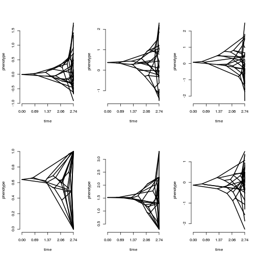
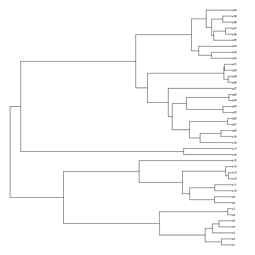
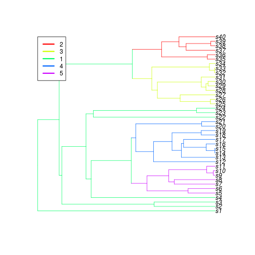

# Tutorial for the R package *treeplyr*
The purpose of *treeplyr* is to provide functions for matching a tree to data, and to manipulate that data using 
*dplyr*--all while maintaining a perfect match between the tree and the data. 

## I. Getting started
First we'll load some packages and generate some data to analyze. We're going to create a somewhat messy dataset
and use *treeplyr* to manipulate the data to fit our needs. 

```r
require(treeplyr)
tree <- geiger::sim.bdtree(stop="taxa", n=50, seed=1)
dat <- data.frame(X1 = rnorm(50), X2 = rnorm(50), X3 = rnorm(50),
                  taxa=c(tree$tip.label[1:40], paste("s", 51:60, sep="")), 
                  D1=sample(c("Hello", "World"), 50, replace=TRUE), D2=rbinom(50,1,0.5), 
                  D3=0.3+rbinom(50, 4, c(0.1,0.1,0.5,0.3)), XNA1 = c(rep(NA, 10), rnorm(40)))
```

Let's check and see what the tree and data look like:

```r
tree
```

```
## 
## Phylogenetic tree with 50 tips and 49 internal nodes.
## 
## Tip labels:
## 	s1, s2, s3, s4, s5, s6, ...
## 
## Rooted; includes branch lengths.
```

```r
head(dat)
```

```
##           X1         X2         X3 taxa    D1 D2  D3 XNA1
## 1 -0.5425200 -1.9143594 -0.1771040   s1 World  1 0.3   NA
## 2  1.2078678  1.1765833  0.4020118   s2 Hello  0 2.3   NA
## 3  1.1604026 -1.6649724 -0.7317482   s3 World  0 2.3   NA
## 4  0.7002136 -0.4635304  0.8303732   s4 World  0 0.3   NA
## 5  1.5868335 -1.1159201 -1.2080828   s5 World  0 0.3   NA
## 6  0.5584864 -0.7508190 -1.0479844   s6 World  0 0.3   NA
```

Notice that the dataset we have created has a mix of trait types, with both discrete and continuous characters, some data with missing data,
and species names buried in the middle of the data matrix. The function *make.treeplyrdata* will search the data table for the column with 
the most matches to the tree, and automatically use this column for matching. It will also search the rownames. Either way, the command is
quite simple:

```r
td <- make.treeplyrdata(tree, dat)
```

We can use summary to display information about our treeplyrdata object. 

```r
summary(td)
```

```
## A treeplyr treeplyrdata object 
## The dataset contains  7  traits 
## Continuous traits:  X1 X2 X3 D3 XNA1 
## Discrete traits:  D1 D2 
## The following traits have missing values: XNA1 
## These taxa were dropped from the tree: s51, s52, s53, s54, s55, s56, s57, s58, s59, s60 
## These taxa were dropped from the data: s41, s42, s43, s44, s45, s46, s47, s48, s49, s50 
## $phy 
## 
## Phylogenetic tree with 40 tips and 39 internal nodes.
## 
## Tip labels:
## 	s1, s2, s3, s4, s5, s6, ...
## 
## Rooted; includes branch lengths.
## 
## $dat 
## Source: local data frame [40 x 7]
## 
##            X1          X2         X3     D1    D2    D3  XNA1
##         <dbl>       <dbl>      <dbl> <fctr> <int> <dbl> <dbl>
## 1  -0.5425200 -1.91435943 -0.1771040  World     1   0.3    NA
## 2   1.2078678  1.17658331  0.4020118  Hello     0   2.3    NA
## 3   1.1604026 -1.66497244 -0.7317482  World     0   2.3    NA
## 4   0.7002136 -0.46353040  0.8303732  World     0   0.3    NA
## 5   1.5868335 -1.11592011 -1.2080828  World     0   0.3    NA
## 6   0.5584864 -0.75081900 -1.0479844  World     0   0.3    NA
## 7  -1.2765922  2.08716655  1.4411577  Hello     0   1.3    NA
## 8  -0.5732654  0.01739562 -1.0158475  Hello     0   1.3    NA
## 9  -1.2246126 -1.28630053  0.4119747  World     0   2.3    NA
## 10 -0.4734006 -1.64060553 -0.3810761  Hello     1   1.3    NA
## ..        ...         ...        ...    ...   ...   ...   ...
```

We can also use indices directly on the treeplyrdata object, but note that these drop the tree:

```r
td[[1]]
```

```
##          s1          s2          s3          s4          s5          s6 
## -0.54252003  1.20786781  1.16040262  0.70021365  1.58683345  0.55848643 
##          s7          s8          s9         s10         s11         s12 
## -1.27659221 -0.57326541 -1.22461261 -0.47340064 -0.62036668  0.04211587 
##         s13         s14         s15         s16         s17         s18 
## -0.91092165  0.15802877 -0.65458464  1.76728727  0.71670748  0.91017423 
##         s19         s20         s21         s22         s23         s24 
##  0.38418536  1.68217608 -0.63573645 -0.46164473  1.43228224 -0.65069635 
##         s25         s26         s27         s28         s29         s30 
## -0.20738074 -0.39280793 -0.31999287 -0.27911330  0.49418833 -0.17733048 
##         s31         s32         s33         s34         s35         s36 
## -0.50595746  1.34303883 -0.21457941 -0.17955653 -0.10019074  0.71266631 
##         s37         s38         s39         s40 
## -0.07356440 -0.03763417 -0.68166048 -0.32427027
```

```r
td[['X1']]
```

```
##          s1          s2          s3          s4          s5          s6 
## -0.54252003  1.20786781  1.16040262  0.70021365  1.58683345  0.55848643 
##          s7          s8          s9         s10         s11         s12 
## -1.27659221 -0.57326541 -1.22461261 -0.47340064 -0.62036668  0.04211587 
##         s13         s14         s15         s16         s17         s18 
## -0.91092165  0.15802877 -0.65458464  1.76728727  0.71670748  0.91017423 
##         s19         s20         s21         s22         s23         s24 
##  0.38418536  1.68217608 -0.63573645 -0.46164473  1.43228224 -0.65069635 
##         s25         s26         s27         s28         s29         s30 
## -0.20738074 -0.39280793 -0.31999287 -0.27911330  0.49418833 -0.17733048 
##         s31         s32         s33         s34         s35         s36 
## -0.50595746  1.34303883 -0.21457941 -0.17955653 -0.10019074  0.71266631 
##         s37         s38         s39         s40 
## -0.07356440 -0.03763417 -0.68166048 -0.32427027
```

```r
td[1:10,1:2]
```

```
## Source: local data frame [10 x 2]
## 
##            X1          X2
##         <dbl>       <dbl>
## 1  -0.5425200 -1.91435943
## 2   1.2078678  1.17658331
## 3   1.1604026 -1.66497244
## 4   0.7002136 -0.46353040
## 5   1.5868335 -1.11592011
## 6   0.5584864 -0.75081900
## 7  -1.2765922  2.08716655
## 8  -0.5732654  0.01739562
## 9  -1.2246126 -1.28630053
## 10 -0.4734006 -1.64060553
```
For single brackets ('[]'), we can specify that we want to keep the tip labels:

```r
td[1:10, 1, tip.label=TRUE]
```

```
## Source: local data frame [10 x 2]
## 
##    tip.label         X1
##       <fctr>      <dbl>
## 1         s1 -0.5425200
## 2         s2  1.2078678
## 3         s3  1.1604026
## 4         s4  0.7002136
## 5         s5  1.5868335
## 6         s6  0.5584864
## 7         s7 -1.2765922
## 8         s8 -0.5732654
## 9         s9 -1.2246126
## 10       s10 -0.4734006
```

## II. The Basics: Reorder, Select, Filter, & Mutate
### *reorder*
The treeplyrdata object itself is made up of a list of two elements *$phy* giving the tree and *$dat* providing in the data. One operation
that is relatively common is changing the ordering of the phylogeny. It's important to maintain a match between the tree and the data. 

```r
td <- reorder(td, "postorder")
```

### *select*
We can use *dplyr* functions *select*, *filter* and *mutate* directly on the treeplyrdata object. The *select* function allows you to choose
which columns you want in the dataset. Any number of columns can be specified:

```r
select(td, X1, D1)
```

```
## $phy 
## 
## Phylogenetic tree with 40 tips and 39 internal nodes.
## 
## Tip labels:
## 	s1, s2, s3, s4, s5, s6, ...
## 
## Rooted; includes branch lengths.
## 
## $dat 
## Source: local data frame [40 x 2]
## 
##            X1     D1
##         <dbl> <fctr>
## 1  -0.5425200  World
## 2   1.2078678  Hello
## 3   1.1604026  World
## 4   0.7002136  World
## 5   1.5868335  World
## 6   0.5584864  World
## 7  -1.2765922  Hello
## 8  -0.5732654  Hello
## 9  -1.2246126  World
## 10 -0.4734006  Hello
## ..        ...    ...
```

```r
select(td, 1:3)
```

```
## $phy 
## 
## Phylogenetic tree with 40 tips and 39 internal nodes.
## 
## Tip labels:
## 	s1, s2, s3, s4, s5, s6, ...
## 
## Rooted; includes branch lengths.
## 
## $dat 
## Source: local data frame [40 x 3]
## 
##            X1          X2         X3
##         <dbl>       <dbl>      <dbl>
## 1  -0.5425200 -1.91435943 -0.1771040
## 2   1.2078678  1.17658331  0.4020118
## 3   1.1604026 -1.66497244 -0.7317482
## 4   0.7002136 -0.46353040  0.8303732
## 5   1.5868335 -1.11592011 -1.2080828
## 6   0.5584864 -0.75081900 -1.0479844
## 7  -1.2765922  2.08716655  1.4411577
## 8  -0.5732654  0.01739562 -1.0158475
## 9  -1.2246126 -1.28630053  0.4119747
## 10 -0.4734006 -1.64060553 -0.3810761
## ..        ...         ...        ...
```

```r
select(td, 1, 4, 6)
```

```
## $phy 
## 
## Phylogenetic tree with 40 tips and 39 internal nodes.
## 
## Tip labels:
## 	s1, s2, s3, s4, s5, s6, ...
## 
## Rooted; includes branch lengths.
## 
## $dat 
## Source: local data frame [40 x 3]
## 
##            X1     D1    D3
##         <dbl> <fctr> <dbl>
## 1  -0.5425200  World   0.3
## 2   1.2078678  Hello   2.3
## 3   1.1604026  World   2.3
## 4   0.7002136  World   0.3
## 5   1.5868335  World   0.3
## 6   0.5584864  World   0.3
## 7  -1.2765922  Hello   1.3
## 8  -0.5732654  Hello   1.3
## 9  -1.2246126  World   2.3
## 10 -0.4734006  Hello   1.3
## ..        ...    ...   ...
```

### *filter*
We can also use the filter function allows us to select only those rows that meet a specific critierion. 
Multiple criteria can be used to limit the dataset even more. note that as the dataset is filtered, the tree
is automatically pruned to reflect the datasets represented.

```r
filter(td, X1 > 0, D1=="Hello", is.na(XNA1)==FALSE)
```

```
## $phy 
## 
## Phylogenetic tree with 6 tips and 5 internal nodes.
## 
## Tip labels:
## [1] "s14" "s16" "s17" "s20" "s32" "s36"
## 
## Rooted; includes branch lengths.
## 
## $dat 
## Source: local data frame [6 x 7]
## 
##          X1          X2          X3     D1    D2    D3       XNA1
##       <dbl>       <dbl>       <dbl> <fctr> <int> <dbl>      <dbl>
## 1 0.1580288 -0.92936215 -0.33090780  Hello     0   0.3 -1.2941400
## 2 1.7672873 -1.07519230  2.49766159  Hello     0   1.3  1.3079015
## 3 0.7167075  1.00002880  0.66706617  Hello     1   0.3  1.4970410
## 4 1.6821761  1.86929062  0.51010842  Hello     1   1.3  0.4820295
## 5 1.3430388  0.10580237  0.00213186  Hello     0   1.3  0.9465856
## 6 0.7126663 -0.03472603  1.80314191  Hello     1   1.3  0.7395892
```

```r
filter(td, X1 + X2 > 0 & D1 == "Hello")
```

```
## $phy 
## 
## Phylogenetic tree with 9 tips and 8 internal nodes.
## 
## Tip labels:
## 	s2, s7, s16, s17, s20, s32, ...
## 
## Rooted; includes branch lengths.
## 
## $dat 
## Source: local data frame [9 x 7]
## 
##           X1          X2          X3     D1    D2    D3         XNA1
##        <dbl>       <dbl>       <dbl> <fctr> <int> <dbl>        <dbl>
## 1  1.2078678  1.17658331  0.40201178  Hello     0   2.3           NA
## 2 -1.2765922  2.08716655  1.44115771  Hello     0   1.3           NA
## 3  1.7672873 -1.07519230  2.49766159  Hello     0   1.3  1.307901520
## 4  0.7167075  1.00002880  0.66706617  Hello     1   0.3  1.497041009
## 5  1.6821761  1.86929062  0.51010842  Hello     1   1.3  0.482029504
## 6  1.3430388  0.10580237  0.00213186  Hello     0   1.3  0.946585640
## 7 -0.2145794  0.45699881 -0.63030033  Hello     0   0.3  0.004398704
## 8  0.7126663 -0.03472603  1.80314191  Hello     1   1.3  0.739589226
## 9 -0.6816605  1.02739244  0.19719344  Hello     0   2.3 -0.289499367
```

### *mutate*
The function *mutate* adds a new variable to the dataset. It may be a transformation of one or more existing variables.
For example, we may wish to log transform a variable, or average two or more variables.

```r
mutate(td, Xall = (X1+X2+X3)/3, D1.binary = as.numeric(D1)-1)
```

```
## $phy 
## 
## Phylogenetic tree with 40 tips and 39 internal nodes.
## 
## Tip labels:
## 	s1, s2, s3, s4, s5, s6, ...
## 
## Rooted; includes branch lengths.
## 
## $dat 
## Source: local data frame [40 x 9]
## 
##            X1          X2         X3     D1    D2    D3  XNA1       Xall
##         <dbl>       <dbl>      <dbl> <fctr> <int> <dbl> <dbl>      <dbl>
## 1  -0.5425200 -1.91435943 -0.1771040  World     1   0.3    NA -0.8779945
## 2   1.2078678  1.17658331  0.4020118  Hello     0   2.3    NA  0.9288210
## 3   1.1604026 -1.66497244 -0.7317482  World     0   2.3    NA -0.4121060
## 4   0.7002136 -0.46353040  0.8303732  World     0   0.3    NA  0.3556855
## 5   1.5868335 -1.11592011 -1.2080828  World     0   0.3    NA -0.2457231
## 6   0.5584864 -0.75081900 -1.0479844  World     0   0.3    NA -0.4134390
## 7  -1.2765922  2.08716655  1.4411577  Hello     0   1.3    NA  0.7505773
## 8  -0.5732654  0.01739562 -1.0158475  Hello     0   1.3    NA -0.5239058
## 9  -1.2246126 -1.28630053  0.4119747  World     0   2.3    NA -0.6996461
## 10 -0.4734006 -1.64060553 -0.3810761  Hello     1   1.3    NA -0.8316941
## ..        ...         ...        ...    ...   ...   ...   ...        ...
## Variables not shown: D1.binary <dbl>.
```

## III. Programmatic use
Note that if you want to use *treeplyr* programatically, you may not want to use these functions, as they will
not result in the desired behavior. For example:

```r
mytraits <- c('X1', 'D1')
try(select(td, mytraits))
```

The *treeplyr* function expects a column called "mytraits" rather than evaluating the variable *mytraits*. To 
use programatically (as with *dplyr*), use the same functions followed by an underscore:

```r
select_(td, .dots=as.list(mytraits))
```

```
## $phy 
## 
## Phylogenetic tree with 40 tips and 39 internal nodes.
## 
## Tip labels:
## 	s1, s2, s3, s4, s5, s6, ...
## 
## Rooted; includes branch lengths.
## 
## $dat 
## Source: local data frame [40 x 2]
## 
##            X1     D1
##         <dbl> <fctr>
## 1  -0.5425200  World
## 2   1.2078678  Hello
## 3   1.1604026  World
## 4   0.7002136  World
## 5   1.5868335  World
## 6   0.5584864  World
## 7  -1.2765922  Hello
## 8  -0.5732654  Hello
## 9  -1.2246126  World
## 10 -0.4734006  Hello
## ..        ...    ...
```

A similar operation can be done for functions such as filter and mutate:

```r
criteria <- list("X1 > -1", "D1 == 'Hello'", "is.na(XNA1)==TRUE")
filter_(td, .dots=criteria)
```

```
## $phy 
## 
## Phylogenetic tree with 3 tips and 2 internal nodes.
## 
## Tip labels:
## [1] "s2"  "s8"  "s10"
## 
## Rooted; includes branch lengths.
## 
## $dat 
## Source: local data frame [3 x 7]
## 
##           X1          X2         X3     D1    D2    D3  XNA1
##        <dbl>       <dbl>      <dbl> <fctr> <int> <dbl> <dbl>
## 1  1.2078678  1.17658331  0.4020118  Hello     0   2.3    NA
## 2 -0.5732654  0.01739562 -1.0158475  Hello     0   1.3    NA
## 3 -0.4734006 -1.64060553 -0.3810761  Hello     1   1.3    NA
```

*treeplyr* is mostly just a wrapper that passes on functions to *dplyr*, so most of the *dplyr* functionality is still there. 
All *treeplyr* does is make sure the tree and data stay matched through the course of your data manipulations. In other words,
you can still combine select, mutate, and filter with lots of other nice *dplyr* functions. Here are some examples:

```r
select(td, starts_with("D"))
```

```
## $phy 
## 
## Phylogenetic tree with 40 tips and 39 internal nodes.
## 
## Tip labels:
## 	s1, s2, s3, s4, s5, s6, ...
## 
## Rooted; includes branch lengths.
## 
## $dat 
## Source: local data frame [40 x 3]
## 
##        D1    D2    D3
##    <fctr> <int> <dbl>
## 1   World     1   0.3
## 2   Hello     0   2.3
## 3   World     0   2.3
## 4   World     0   0.3
## 5   World     0   0.3
## 6   World     0   0.3
## 7   Hello     0   1.3
## 8   Hello     0   1.3
## 9   World     0   2.3
## 10  Hello     1   1.3
## ..    ...   ...   ...
```

```r
select(td, ends_with("1"))
```

```
## $phy 
## 
## Phylogenetic tree with 40 tips and 39 internal nodes.
## 
## Tip labels:
## 	s1, s2, s3, s4, s5, s6, ...
## 
## Rooted; includes branch lengths.
## 
## $dat 
## Source: local data frame [40 x 3]
## 
##            X1     D1  XNA1
##         <dbl> <fctr> <dbl>
## 1  -0.5425200  World    NA
## 2   1.2078678  Hello    NA
## 3   1.1604026  World    NA
## 4   0.7002136  World    NA
## 5   1.5868335  World    NA
## 6   0.5584864  World    NA
## 7  -1.2765922  Hello    NA
## 8  -0.5732654  Hello    NA
## 9  -1.2246126  World    NA
## 10 -0.4734006  Hello    NA
## ..        ...    ...   ...
```

```r
select(td, matches("NA"))
```

```
## Error: All select() inputs must resolve to integer column positions.
## The following do not:
## *  matches("NA")
```

```r
select(td, contains("NA"))
```

```
## $phy 
## 
## Phylogenetic tree with 40 tips and 39 internal nodes.
## 
## Tip labels:
## 	s1, s2, s3, s4, s5, s6, ...
## 
## Rooted; includes branch lengths.
## 
## $dat 
## Source: local data frame [40 x 1]
## 
##     XNA1
##    <dbl>
## 1     NA
## 2     NA
## 3     NA
## 4     NA
## 5     NA
## 6     NA
## 7     NA
## 8     NA
## 9     NA
## 10    NA
## ..   ...
```

```r
select(td, which(sapply(td$dat, type_sum)=="int"))
```

```
## $phy 
## 
## Phylogenetic tree with 40 tips and 39 internal nodes.
## 
## Tip labels:
## 	s1, s2, s3, s4, s5, s6, ...
## 
## Rooted; includes branch lengths.
## 
## $dat 
## Source: local data frame [40 x 1]
## 
##       D2
##    <int>
## 1      1
## 2      0
## 3      0
## 4      0
## 5      0
## 6      0
## 7      0
## 8      0
## 9      0
## 10     1
## ..   ...
```

Or dropping columns:

```r
select(td, -matches("NA"))
```

```
## Error in -matches("NA"): invalid argument to unary operator
```

```r
select(td, -starts_with("X"))
```

```
## $phy 
## 
## Phylogenetic tree with 40 tips and 39 internal nodes.
## 
## Tip labels:
## 	s1, s2, s3, s4, s5, s6, ...
## 
## Rooted; includes branch lengths.
## 
## $dat 
## Source: local data frame [40 x 3]
## 
##        D1    D2    D3
##    <fctr> <int> <dbl>
## 1   World     1   0.3
## 2   Hello     0   2.3
## 3   World     0   2.3
## 4   World     0   0.3
## 5   World     0   0.3
## 6   World     0   0.3
## 7   Hello     0   1.3
## 8   Hello     0   1.3
## 9   World     0   2.3
## 10  Hello     1   1.3
## ..    ...   ...   ...
```

## IV. Applying functions to treeplyrdata objects: treeply, treedply and tdapply
In many cases, the user may simply want to split apart the treeplyrdata object after matching and proceed in their analyses as normal. 
For example, we could measure phylogenetic signal in our trait *X1*:

```r
phytools::phylosig(td$phy, getVector(td, X1))
```

```
## [1] 0.05983494
```

### *treedply*
You can also run it directly on the treeplyrdata object using the function treedply:

```r
treedply(td, phytools::phylosig(phy, getVector(td, X1), "K"))
```

```
## [1] 0.05983494
```

        
Or multiple functions at once: 

```r
treedply(td, list("K" = phytools::phylosig(phy, getVector(td, X1), "K"),
                  "lambda" = phytools::phylosig(phy, getVector(td, X1), "lambda"))
         )
```

```
## $K
## [1] 0.05983494
## 
## $lambda
## $lambda$lambda
## [1] 7.351765e-05
## 
## $lambda$logL
## [1] -48.07617
```

### *forceFactor* & *forceNumeric*
We can also use the function *tdapply* which calls the *apply* function, but allows inclusion of the phylogeny. This can be useful for 
applying the same function over every column in our dataset. First though, we can use the functions *forceNumeric* and *forceFactor* to 
make sure that every column is of a type that can be analyzed by a function like *phenogram* or *phylosig*.  These functions to force 
the traits in the treeplyrdata object to be a factor or a continuous data, dropping those that cannot be converted. 

```r
tdDiscrete <- forceFactor(td)
```

```
## Warning in forceFactor(td): Data contain numeric entries, which will be
## converted to factors
```

```
## Warning in forceFactor(td): Conversion failed for data columns X1 X2 X3 as
## these data have no shared states. These data will be removed
```

```r
tdNumeric <- forceNumeric(td)
```

```
## Warning in forceNumeric(td): Not all data continuous, dropping non-numeric
## data columns: D1
```

We can further filter out missing data in the trait *XNA1*.

```r
tdNumeric <- filter(tdNumeric, !is.na(XNA1))
```

### *tdapply*
Then we can apply a function like *phenogram* to plot all the data:

```r
par(mfrow=c(2,3))
tdapply(tdNumeric, 2, phytools::phenogram, tree=phy, spread.labels=FALSE, ftype="off")
```



```
##       X1 X2 X3 D2 D3 XNA1
##  [1,] NA NA NA NA NA   NA
##  [2,] NA NA NA NA NA   NA
##  [3,] NA NA NA NA NA   NA
##  [4,] NA NA NA NA NA   NA
##  [5,] NA NA NA NA NA   NA
##  [6,] NA NA NA NA NA   NA
##  [7,] NA NA NA NA NA   NA
##  [8,] NA NA NA NA NA   NA
##  [9,] NA NA NA NA NA   NA
## [10,] NA NA NA NA NA   NA
## [11,] NA NA NA NA NA   NA
## [12,] NA NA NA NA NA   NA
## [13,] NA NA NA NA NA   NA
## [14,] NA NA NA NA NA   NA
## [15,] NA NA NA NA NA   NA
## [16,] NA NA NA NA NA   NA
## [17,] NA NA NA NA NA   NA
## [18,] NA NA NA NA NA   NA
## [19,] NA NA NA NA NA   NA
## [20,] NA NA NA NA NA   NA
## [21,] NA NA NA NA NA   NA
## [22,] NA NA NA NA NA   NA
## [23,] NA NA NA NA NA   NA
## [24,] NA NA NA NA NA   NA
## [25,] NA NA NA NA NA   NA
## [26,] NA NA NA NA NA   NA
## [27,] NA NA NA NA NA   NA
## [28,] NA NA NA NA NA   NA
## [29,] NA NA NA NA NA   NA
## [30,] NA NA NA NA NA   NA
## [31,] NA NA NA NA NA   NA
## [32,] NA NA NA NA NA   NA
## [33,] NA NA NA NA NA   NA
## [34,] NA NA NA NA NA   NA
## [35,] NA NA NA NA NA   NA
## [36,] NA NA NA NA NA   NA
## [37,] NA NA NA NA NA   NA
## [38,] NA NA NA NA NA   NA
## [39,] NA NA NA NA NA   NA
## [40,] NA NA NA NA NA   NA
## [41,] NA NA NA NA NA   NA
## [42,] NA NA NA NA NA   NA
## [43,] NA NA NA NA NA   NA
## [44,] NA NA NA NA NA   NA
## [45,] NA NA NA NA NA   NA
## [46,] NA NA NA NA NA   NA
## [47,] NA NA NA NA NA   NA
## [48,] NA NA NA NA NA   NA
## [49,] NA NA NA NA NA   NA
## [50,] NA NA NA NA NA   NA
## [51,] NA NA NA NA NA   NA
## [52,] NA NA NA NA NA   NA
## [53,] NA NA NA NA NA   NA
## [54,] NA NA NA NA NA   NA
## [55,] NA NA NA NA NA   NA
## [56,] NA NA NA NA NA   NA
## [57,] NA NA NA NA NA   NA
## [58,] NA NA NA NA NA   NA
## [59,] NA NA NA NA NA   NA
## [60,] NA NA NA NA NA   NA
```

Or you could fit all traits to a BM model and then pull out the sigsq parameter:

```r
fitsBM <- tdapply(tdNumeric, 2, geiger::fitContinuous, phy=phy, model="BM")
sapply(fitsBM, function(x) x$opt$sigsq)
```

```
##         X1         X2         X3         D2         D3       XNA1 
##  5.3712587  3.9081367 11.1951598  0.9168851 19.4370364  8.8442750
```

Perhaps more elegantly, you could use pipes to chain all of these operations together:

```r
td %>% filter(., !is.na(XNA1)) %>% forceNumeric(.) %>% tdapply(., 2, phytools::phylosig, tree=phy)
```

```
## Warning in forceNumeric(.): Not all data continuous, dropping non-numeric
## data columns: D1
```

```
##         X1         X2         X3         D2         D3       XNA1 
## 0.04615520 0.12933582 0.05012148 0.12608836 0.02233654 0.04680584
```

You can manipulate the tree as well, using the function *treeply*, which is meant for simple operations on the tree alone that may 
or may not change the number of tips. For example, let's use the *geiger* function *rescale.phylo* to rescale the branches according 
to an OU model with an alpha value of 10. 

```r
td.OU10 <- treeply(td, geiger::rescale, model="OU", 10)
par(mfrow=c(1,2))
plot(td$phy)
plot(td.OU10$phy)
```



Or we could drop tips from the tree (here we drop tips from 1 to 35).

```r
treeply(td, drop.tip, c(1:35))
```

```
## $phy 
## 
## Phylogenetic tree with 5 tips and 4 internal nodes.
## 
## Tip labels:
## [1] "s36" "s37" "s38" "s39" "s40"
## 
## Rooted; includes branch lengths.
## 
## $dat 
## Source: local data frame [5 x 7]
## 
##            X1          X2         X3     D1    D2    D3       XNA1
##         <dbl>       <dbl>      <dbl> <fctr> <int> <dbl>      <dbl>
## 1  0.71266631 -0.03472603  1.8031419  Hello     1   1.3  0.7395892
## 2 -0.07356440  0.78763961 -0.3311320  World     0   0.3 -1.0634574
## 3 -0.03763417  2.07524501 -1.6055134  World     1   0.3  0.2462108
## 4 -0.68166048  1.02739244  0.1971934  Hello     0   2.3 -0.2894994
## 5 -0.32427027  1.20790840  0.2631756  World     1   0.3 -2.2648894
```

## V. Grouping
One of the cool features about *dplyr* is that it allows you to group variables and perform analyses independently 
on different groups with a single command. Currently, *treeplyr* only supports a single grouping variable at a time, 
but allows similar functionality. In this example, we will group taxa by the trait *D1*. You could easily imagine 
using this for a taxonomic level on the tree.

```r
td.D1 <- group_by(td, D1)
```

### *summarize*/*summarise*
What good does this do? Well, we can use *summarize* to apply functions to specific groups.

```r
summarize(td.D1, mean(X1), sd(X1), mean(X2), sd(X2))
```

```
## Source: local data frame [2 x 5]
## 
##       D1   mean(X1)    sd(X1)    mean(X2)   sd(X2)
##   <fctr>      <dbl>     <dbl>       <dbl>    <dbl>
## 1  Hello 0.09735458 0.9546852  0.10771534 1.089466
## 2  World 0.07318464 0.7174964 -0.01201879 1.231206
```

But what about if our functions require a phylogeny? Well, we can do that too:

```r
summarise(td.D1, ntips = length(phy$tip.label), 
            psig.X1 = phytools::phylosig(setNames(X1, phy$tip.label), tree=phy),
              psig.X2 = phytools::phylosig(setNames(X2, phy$tip.label), tree=phy))
```

```
## Source: local data frame [2 x 4]
## 
##       D1 ntips    psig.X1   psig.X2
##   <fctr> <int>      <dbl>     <dbl>
## 1  Hello    17 0.05241561 0.2112923
## 2  World    23 0.29027126 0.3809347
```

Note both British and American spellings of *summarize/summarise* work.You might also want to do something like find 
the total branch length found in different groups of taxa:

```r
summarise(td.D1, ntips = length(phy$tip.label), 
              totalTL = sum(phy$edge.length), varianceBL = var(phy$edge.length))
```

```
## Source: local data frame [2 x 4]
## 
##       D1 ntips  totalTL varianceBL
##   <fctr> <int>    <dbl>      <dbl>
## 1  Hello    17 18.23593  0.3182517
## 2  World    23 30.73710  0.5296092
```

Or you could fit models of trait evolution to different groups in the tree (but note this is a dumb way
to build a summary table, as the fitContinuous function is run independently for each parameter).

```r
summarise(td.D1, sigsq = geiger::fitContinuous(phy, setNames(X1, phy$tip.label))$opt$sigsq, 
                 root = geiger::fitContinuous(phy, setNames(X1, phy$tip.label))$opt$z0)
```

```
## Source: local data frame [2 x 3]
## 
##       D1     sigsq       root
##   <fctr>     <dbl>      <dbl>
## 1  Hello 7.9724838 0.36027556
## 2  World 0.6679094 0.04721332
```

### *paint_clades*
We can also create a new variable that paints clades according to a particular set of nodes or branches (assuming a postordered tree). 
by using the function *paint_clades*. 

```r
td.painted <- paint_clades(td, interactive=FALSE, type="nodes", ids=c(75, 66, 54, 48), plot=TRUE)
```



Or alternatively, you can specify which clades you want to group interactively. In the case below, the user selects 4 clades 
by clicking on the desired branches (i.e. when you run this script,YOU must click on 4 branches of your choosing 
to move forward!!): 

```r
td.painted <- paint_clades(td, 4, interactive=TRUE)
```

Now we group the phylogeny by the *clades* variable we just defined and calculate summary statistics for each group.

```r
td.painted <- group_by(td.painted, clades)
summarise(td.painted, psig1 = phytools::phylosig(setNames(X1, phy$tip.label), tree=phy), 
          meanX1 = mean(X1), sdX1 = sd(X1), ntips =length(phy$tip.label))
```

```
## Source: local data frame [5 x 5]
## 
##   clades      psig1      meanX1      sdX1 ntips
##    <dbl>      <dbl>       <dbl>     <dbl> <int>
## 1      1 0.27062158  0.40655789 0.9238538     7
## 2      2 0.27862586 -0.08410896 0.4587212     6
## 3      3 0.03721839 -0.04394916 0.5549763    10
## 4      4 0.12079308  0.34594323 0.9389773    10
## 5      5 0.60748135 -0.28898824 1.0256955     7
```

Currently, the functions *treeply*, *treedply* and *tdapply* do not work with grouped data frames, and will analyze the 
entire dataset rather than specified subgroups. This will be added in future versions of *treeplyr*. 
